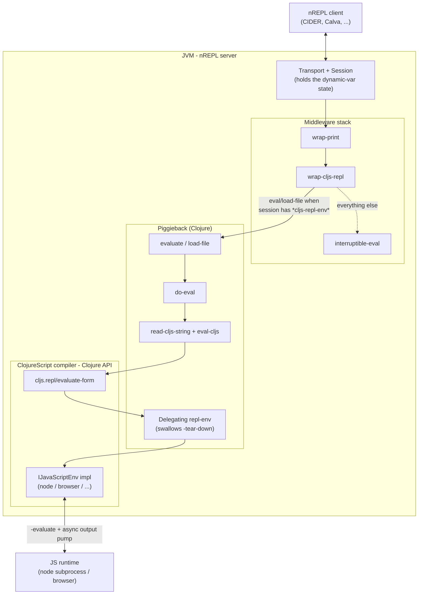
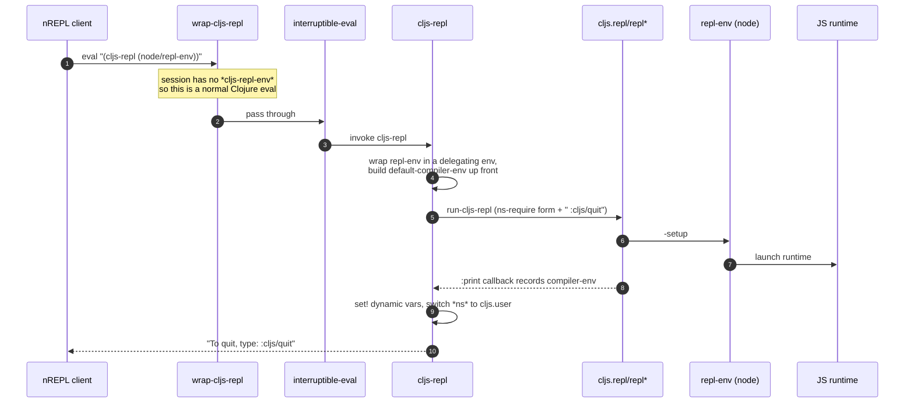
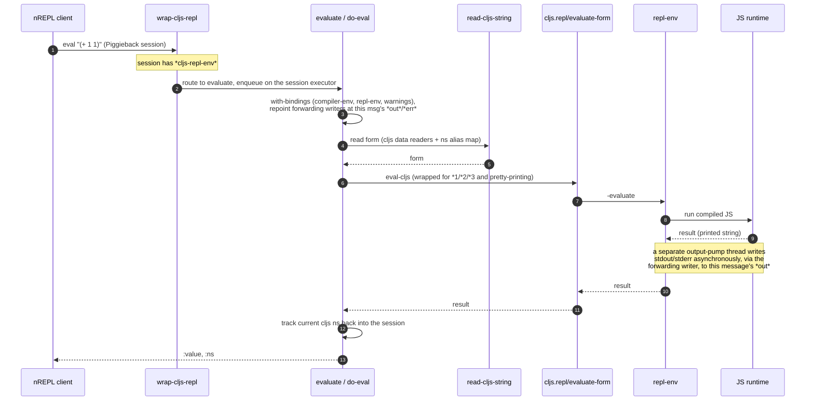
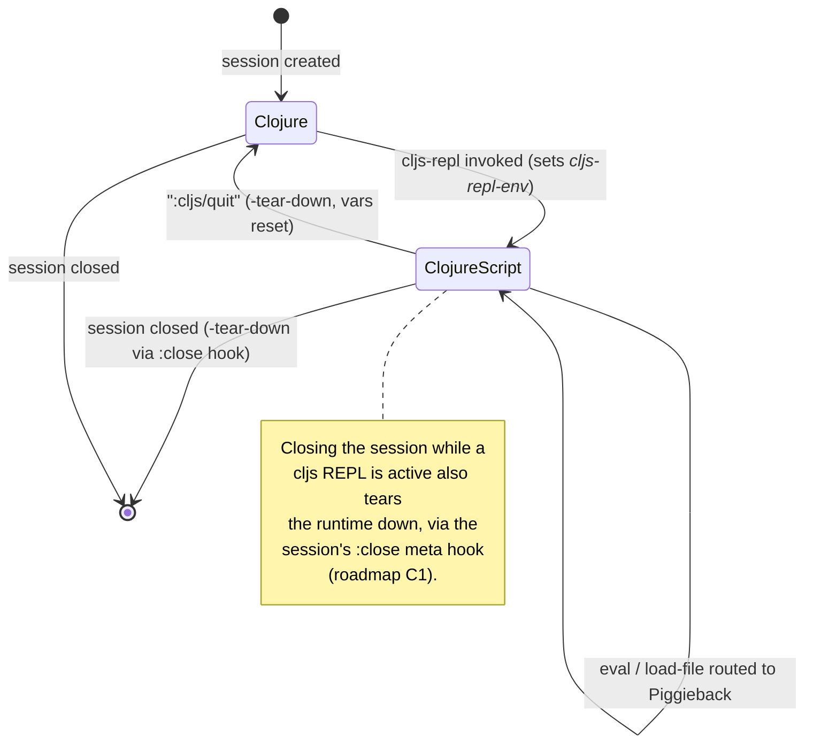

# Piggieback Architecture

This document explains how Piggieback works internally: how it sits inside an
nREPL server, how it routes ClojureScript evaluation, and the mechanisms it uses
to bridge two runtimes that were never designed to meet. It complements the
shorter "Design" section in the [README](../README.md), which covers the
user-facing behaviour and rationale.

If you are here to plan changes rather than understand the current code, see the
[roadmap](roadmap.md).

## Purpose and scope

Piggieback is a single, focused thing: an nREPL middleware that lets a normal
nREPL server evaluate ClojureScript in the official `cljs.repl` REPL
environments (node, browser, graaljs, ...) without a separate build tool. It is
written in Clojure and runs on the JVM. It drives ClojureScript evaluation
through ClojureScript's Clojure-facing compiler API, primarily the
`cljs.repl/IJavaScriptEnv` protocol.

What it is *not*: a build tool, a hot-reload system, or a replacement for
shadow-cljs / figwheel-main (both of which ship their own nREPL story and do not
use Piggieback). The clearest way to think about Piggieback today is as the thin,
correct adapter between nREPL and stock `cljs.repl` environments, plus CIDER's
built-in default for "just give me a cljs REPL."

## Mental model: one server, two languages

A single nREPL server can host both Clojure and ClojureScript evaluation at the
same time, on a per-session basis. Whether a given `eval` runs as Clojure or as
ClojureScript is decided entirely by session state, not by anything the client
puts in the message. A client "enters" ClojureScript by evaluating
`(cider.piggieback/cljs-repl <repl-env>)` in a session; from then on, that
session's `eval` and `load-file` ops are handled by Piggieback until the client
sends `:cljs/quit`.

The key seam is `wrap-cljs-repl`: for every message it inspects the session. If
the session has an active `*cljs-repl-env*` and the op is `eval` or `load-file`,
it hijacks the message and runs Piggieback's ClojureScript evaluation. Otherwise
it passes the message straight through to the rest of the stack (ordinary
Clojure handling).

## Core concepts

### Session-based dispatch

Piggieback operates at the nREPL *session* level. Clients do not pass an
`:env :cljs` parameter or call a dedicated op; they just keep using `eval` with a
session that has a ClojureScript REPL active. This is what makes a mixed
Clojure/ClojureScript server transparent to tooling. The price is that
ClojureScript-ness is implicit in the eval flow: clients don't flag a message as
cljs. To let tooling detect it from the protocol rather than out of band,
Piggieback contributes its per-session status (whether a cljs REPL is active, and
which repl-env) to the `describe` response's `:aux` map via a `:describe-fn`.
(See roadmap item M3.)

### Dynamic vars as session state

ClojureScript REPL state lives in a handful of dynamic vars interned in the
`cider.piggieback` namespace (they are public, since other middleware read them
out of the session by name):

| Var | Holds |
| --- | --- |
| `*cljs-repl-env*` | the active (delegating) repl-env; also the "are we in cljs?" flag |
| `*cljs-compiler-env*` | the ClojureScript compiler environment (analyzer/compiler state) |
| `*cljs-repl-options*` | the merged repl options |
| `*cljs-warnings*` / `*cljs-warning-handlers*` | analyzer warning configuration |
| `*original-clj-ns*` | the Clojure namespace to restore on `:cljs/quit` |
| `*cljs-out-target*` / `*cljs-err-target*` | atoms repointed at the current message's output (see Output forwarding) |

These are not root-bound. nREPL's session middleware establishes per-message
thread bindings for the vars stored in the session atom, and merges any `set!`
changes back into the session atom when the message completes. So the flow is:
`cljs-repl` does `set!` on these vars (which works because the bindings exist for
the duration of the message), and `wrap-cljs-repl` seeds the session atom with
them up front so the bindings are present. This is also why `cljs-repl` fails
fast if it is called outside a session: with no thread binding, `set!` would
throw a cryptic root-binding error (issue #124).

### Optional ClojureScript

Piggieback has no hard dependency on ClojureScript, so tools can load it
unconditionally. There are two namespaces:

- `cider.piggieback` - the always-loadable public face. It requires only nREPL,
  holds the session-state dynamic vars (the part other middleware read by name),
  and exposes the public API as thin delegators.
- `cider.piggieback.cljs` - the implementation, which requires the ClojureScript
  compiler and holds the handlers. It is loaded lazily, on first use, and only
  when ClojureScript is on the classpath.

`cider.piggieback` checks for ClojureScript by trying to `require` `cljs.repl`
directly (not the implementation namespace, which would trigger a load cycle
since the implementation requires `cider.piggieback` back). When ClojureScript is
present, the public functions resolve their counterparts in
`cider.piggieback.cljs` via `requiring-resolve` on first call; when it is absent,
`wrap-cljs-repl` is a no-op and `cljs-repl` throws a clear "did you forget a
dependency?" error (roadmap item S1).

## Lifecycle walkthroughs

### Starting a ClojureScript REPL

Setup is the one place Piggieback drives `cljs.repl/repl*` (the full REPL loop)
rather than evaluating forms itself. It feeds the loop a single namespace-require
form plus `:cljs/quit`, with no-op `:prompt` / `:need-prompt` / `:init`
callbacks, and reaches the compiler env back out through the `:print` callback.
The compiler env is also created up front and captured unconditionally, so that
evaluation still works even if the setup eval errors before `:print` runs (issue
#62).

### Evaluating a form

Ongoing evaluation does *not* go through `repl*`. It calls
`cljs.repl/evaluate-form` directly, reusing the compiler env and repl-env stored
in the session. The result comes back as a printed string, which Piggieback
re-reads with an EDN reader (using `UnknownTaggedLiteral` as the default tag
handler so unknown tagged literals round-trip) before sending it as `:value`.

Note the two distinct evaluation paths (setup via `repl*`, steady-state via
`evaluate-form`). That split is the source of much of Piggieback's incidental
complexity and is the target of the largest planned refactor (roadmap item B1).

### Session REPL state and teardown

Teardown happens on an explicit `:cljs/quit` and also when the session is closed
while a cljs REPL is active. Since nREPL's session middleware handles the `close`
op itself and never delegates it to Piggieback, the latter is wired by composing
a teardown into the session's `:close` metadata fn (the one
`nrepl.middleware.session/close-session` invokes) when the REPL starts. This
keeps a client that closes its session (or exits) without `:cljs/quit` from
leaking the JavaScript runtime (roadmap item C1).

Note this covers session *close*, not a silently dropped TCP connection: nREPL
sessions deliberately outlive their connection (so you can reconnect, as the
output-routing test exercises), so a dropped connection alone does not close the
session or trigger teardown.

## Implementation mechanisms

These are the non-obvious pieces that make the bridge work.

### Delegating repl-env

`cljs.repl/repl*` calls `-tear-down` on the repl-env when its loop exits, which
(because setup appends `:cljs/quit`) would tear the env down immediately after
setup. To prevent that, Piggieback wraps the real repl-env in a generated
"delegating" type whose `-tear-down` is a no-op and which forwards every other
`IJavaScriptEnv` method (and map-like access) to the wrapped env. The wrapper is
currently generated per repl-env class at runtime via `eval`. Removing the
`repl*` driving would remove the need for this wrapper entirely (roadmap B1).

### Output forwarding (issue #111)

ClojureScript repl envs such as the node env run an asynchronous output pump on
their own thread and capture `*out*` once, at setup time, via `bound-fn`. Under
nREPL, `*out*` is rebound per message, so a captured `*out*` would keep sending
all later output to the message that *started* the REPL (and that output would
vanish once that connection closed). Piggieback hands the env a
`forwarding-writer`: a `java.io.Writer` that delegates to whatever writer is
currently held in an atom (`*cljs-out-target*` / `*cljs-err-target*`). On each
evaluation, `do-eval` repoints those atoms at the current message's output. The
writer flushes rather than closes on `close`, because the underlying per-message
writers are owned by nREPL.

### Namespace tracking

The current ClojureScript namespace (`cljs.analyzer/*cljs-ns*`) is stored in the
session atom and updated after each eval, so that `in-ns` and namespace switches
persist across messages and are reported back as `:ns`. The reader is configured
with the analyzer's `resolve-symbol`, the cljs data readers, and an alias map
reconstructed from the current namespace's `:requires` / `:require-macros`, so
that alias-qualified keywords and reader conditionals read correctly.

### Result wrapping: `*1` `*2` `*3` `*e` and pretty-printing

Before evaluation, the form is wrapped (`pprint-repl-wrap-fn`) so that the result
rolls the REPL history vars (`*1`/`*2`/`*3`), captures exceptions into `*e`, and
optionally pretty-prints. The choice between plain printing and pretty-printing
currently keys off the name of the requested print function. ns/require/import
forms are passed through unwrapped.

### Special forms

ClojureScript REPL special functions (`cljs.repl/default-special-fns`, merged
with any from the repl options) are dispatched directly rather than evaluated, so
things like `load-file`, `in-ns`, and `require` behave like REPL specials.

### Loading a file

The `load-file` op evaluates the source sent in the message (its `:file`), using
`cljs.repl/load-stream` to read and evaluate every top-level form against the
active repl-env, with the analyzer namespace restored afterwards. This loads the
client's buffer content, including unsaved changes, matching Clojure nREPL
semantics. If a message arrives without `:file` content, Piggieback falls back to
the cljs `load-file` special function, which reads from disk (roadmap item C2).

## Structural constraints and known gaps

These are limitations that are either upstream or architectural; each maps to a
roadmap item.

- **One node REPL per JVM.** `cljs.repl.node` keys its results/output state by
  thread name, which collapses nREPL's worker threads together. Two node REPLs in
  one JVM clobber each other. Upstream; roadmap U1 (issues #105, #88).
- **`*out*` capture.** The forwarding-writer machinery exists only to compensate
  for the node env capturing `*out*` at setup. The clean fix is upstream; roadmap
  U2.
- **Dropped connections.** Session close now tears the runtime down (roadmap
  C1), but a silently dropped TCP connection does not close the session, so it
  cannot trigger teardown; such a session lingers until an explicit close or
  server shutdown.
- **Multi-form evaluation.** Only the first form of a multi-form string is
  evaluated, because steady-state eval does not spin a fresh `cljs.repl` per
  message (see the README Design section).
- **Interrupt.** A long-running JS eval cannot be cancelled cleanly. This is
  largely inherent to single-threaded JS runtimes; it is documented in the
  README ("Interrupting evaluation").

## Compatibility surface

Piggieback supports a range of nREPL versions (1.0 through current). The
differences are handled by runtime feature detection (for example resolving
`interruptible-eval/evaluator` to decide how to bind per-message state, and
resolving `replying-PrintWriter` for print middleware). These checks live in one
place, the `cider.piggieback.compat` namespace (roadmap item M1).

Piggieback also couples tightly to ClojureScript compiler internals
(`cljs.analyzer`, `cljs.env`, `cljs.closure`, `cljs.tagged-literals`, and the
non-public parts of `cljs.repl`). This is largely unavoidable given there is no
public "evaluate a cljs form in this env and hand me the result" API, but it is
fragile, so it is confined to a single namespace, `cider.piggieback.cljs`, which
exposes a small Clojure-facing API the middleware talks to instead of reaching
into the compiler directly (roadmap item M2). That boundary is also what makes
the planned evaluation-ownership refactor (B1) tractable.
