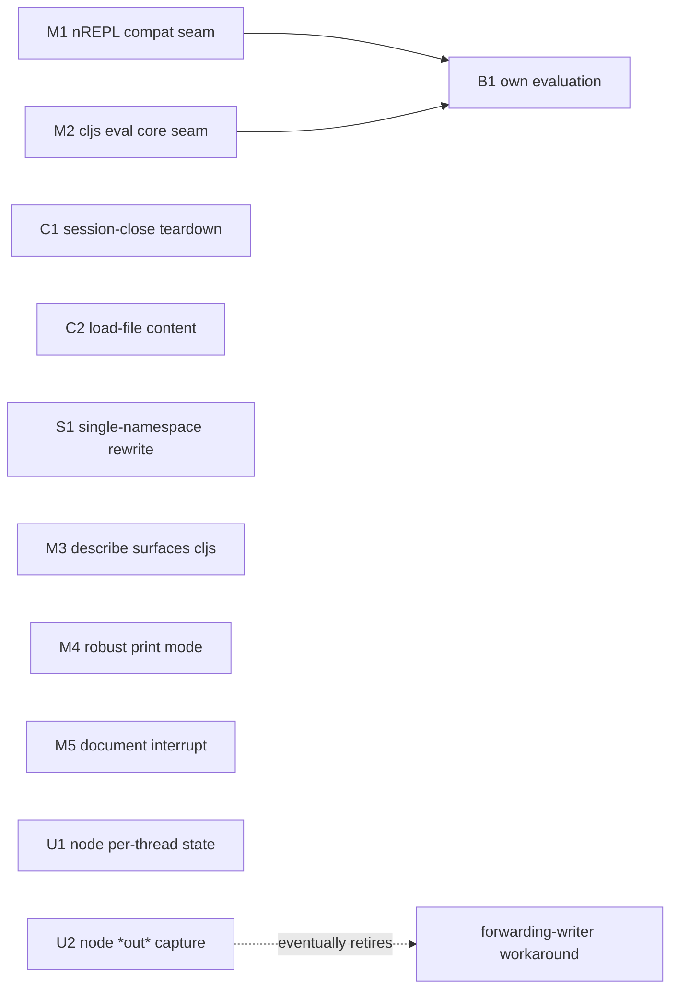

# Piggieback Roadmap

A plan for evolving Piggieback's internals. This is a direction, not a contract:
items can be reordered or dropped as we learn more. For how the current code
works, see the [architecture document](architecture.md).

## Guiding principle

Piggieback's job is narrow and worth doing well: be the thin, correct adapter
between nREPL and the official `cljs.repl` environments, and CIDER's built-in
default cljs REPL. shadow-cljs and figwheel-main own the heavyweight build-tool
space and bring their own nREPL integration, so Piggieback should not chase
features they already cover (hot reload, asset serving, file watching). Almost
every item below is "make the adapter simpler or more correct," not "add
surface."

## Sequencing rationale

The instinct to start small is right, and for a stronger reason than low risk:
two of the small items are the *seams* that make the one scary refactor safe.

- **M1** (centralize nREPL-version compatibility) and **M2** (isolate the
  ClojureScript-internals coupling into one thin eval core) carve out clean
  boundaries. Once they exist, **B1** (own evaluation, drop the `repl*` driving)
  is a change behind a known interface instead of open-heart surgery.
- **C1** and **C2** are standalone correctness wins with no dependency on
  anything else, so they ride along early and ship value immediately.

So the order is: seams and correctness first, structural simplification next, the
core refactor once the seams are in place, and upstream work filed early because
it has the longest lead time.

## Status

- Done: tooling modernization. CI matrix (CircleCI, JDK 8-25, Clojure 1.10-1.12,
  nREPL 1.0-1.7), `deps.edn` alongside Leiningen, clj-kondo added, cljfmt and
  Eastwood on current versions, dependencies refreshed.
- Done: the Phase 2 correctness bugs from the 0.6.2 release (#62, #111, #120,
  #124).

## Phase 1 - Seams and small modernizations

Low risk, high clarity, and partly preparatory for Phase 4.

### M1 - Centralize cross-nREPL-version compatibility

Today, support for the supported nREPL range is handled by `resolve`-based
feature detection scattered through the implementation (`nrepl-1-3+?`,
`replying-PrintWriter` lookup, the `enqueue` double-binding dance). Pull these
into one small compatibility namespace with named, documented predicates and
shims.

- Why: one place to reason about version differences; less noise in the eval path.
- Risk: low. Pure refactor, behaviour-preserving, fully covered by the nREPL
  matrix in CI.

### M2 - Isolate the ClojureScript-internals coupling

Gather the direct reaches into `cljs.analyzer`, `cljs.env`, `cljs.closure`,
`cljs.tagged-literals`, and the non-public parts of `cljs.repl` into a single,
thin, version-guarded "cljs eval core" namespace. The handler code should talk to
that core, not to compiler internals directly.

- Why: this is the seam B1 needs. It also localizes the fragility, so a breaking
  ClojureScript change touches one file.
- Risk: low to moderate. Mechanical extraction, but it touches the hot path, so
  lean on the existing tests and add characterization tests where thin.
- Prerequisite for: B1.

### M3 - Surface ClojureScript state in `describe`

Advertise Piggieback in the `describe` response and expose whether a session is
currently in ClojureScript mode (and ideally which repl-env). Optionally echo
cljs-ness on eval responses.

- Why: tooling currently infers ClojureScript mode out of band. A protocol-level
  signal lets clients stop guessing.
- Risk: low. Additive.

### M4 - Robust print-mode detection

Replace the current string-name matching against specific print functions with a
more robust signal for choosing plain vs pretty printing.

- Why: the present check breaks the moment a different pretty-printer is used.
- Risk: low.

### M5 - Document the interrupt limitation

A long-running JS eval cannot be cancelled cleanly. Document this clearly rather
than leaving it implicit, and decide whether any best-effort behaviour is worth
offering.

- Why: sets correct expectations; cheap.
- Risk: none (documentation).

## Phase 2 - Standalone correctness wins

Independent of everything else; ship as soon as ready.

### C1 - Tear down on session close

Register cleanup on session close / expiry so the active repl-env's `-tear-down`
runs even when the client never sends `:cljs/quit` (dropped connection, editor
killed, client exit). Today the node subprocess or browser connection leaks.

- Why: a real resource leak that bites anyone who closes an editor without
  quitting the cljs REPL first.
- Risk: low to moderate. Needs care around nREPL session lifecycle hooks and not
  double-tearing-down on a normal quit. Add a regression test.

### C2 - `load-file` evaluates the sent content

Make `load-file` compile the source provided in the message against the right
namespace and path, rather than re-reading the file from disk. This matches
Clojure nREPL semantics ("load buffer" should load what is in the buffer).

- Why: loading an unsaved buffer currently loads the last-saved version, silently.
- Risk: moderate. Touches the `load-file` path and the path/namespace handling;
  needs tests for both saved and unsaved content.

## Phase 3 - Structural simplification

### S1 - Single namespace via `requiring-resolve`

Collapse the three-file `if-ns` + `(load ...)` + `(in-ns)` structure into one
namespace that resolves the ClojureScript machinery lazily at first use and
returns a no-op middleware when ClojureScript is absent.

- Why: removes the `redefined-var` / `unresolved-symbol` friction we currently
  paper over in clj-kondo config, and reads far more honestly. Clojure 1.10
  (our floor) has `requiring-resolve`.
- Risk: moderate. The no-ClojureScript path must stay a genuine no-op; test both
  with and without ClojureScript on the classpath.

## Phase 4 - The core refactor

### B1 - Own evaluation; remove the `repl*` driving and the codegen delegator

Stop driving `cljs.repl/repl*` for setup. Instead: run `-setup` once, establish
the analyzer/compiler bindings explicitly, run the initial requires as an ordinary
`evaluate-form`, and use one uniform evaluation path for everything. This
collapses the two evaluation paths into one, removes the `:print`-callback
side-channel for reaching compiler state, and eliminates the runtime-generated
delegating repl-env (which exists only to swallow the `-tear-down` that `repl*`
would otherwise trigger after setup).

- Why: this split is the root cause of most of Piggieback's historical bugs
  (compiler-env capture, output routing, ns tracking). Unifying the path is what
  stops the next decade of the same class of bug.
- Risk: high. This is the riskiest change in the plan. Do it on a branch, behind
  the full CI matrix, after M1 and M2 have established clean seams.
- Depends on: M1, M2.

## Phase 5 - Upstream work

File these early; they have the longest lead time and help the wider ecosystem
(shadow-cljs and figwheel-main hit the same walls).

### U1 - `cljs.repl.node` per-thread state (issues #105, #88)

`cljs.repl.node` keys its results/output state by thread name, which collapses
nREPL's worker threads and prevents two node REPLs in one JVM. Propose keying by
env identity instead. Until/unless it lands upstream, a vendored corrected node
env is a fallback.

- Why: lifts the "one node REPL per JVM" ceiling, which increasingly bites (two
  editor windows, or node plus browser at once).
- Risk: the change itself is small; the lead time is in coordinating upstream.

### U2 - node env `*out*` capture (root cause of #111)

Propose letting the node env take an explicit writer / output-fn instead of
capturing `*out*` at setup. If accepted, Piggieback's forwarding-writer
workaround can eventually be retired.

- Why: removes load-bearing cleverness in favour of a clean upstream contract.
- Risk: long lead time; the local workaround stays until it lands.

## Dependency summary

